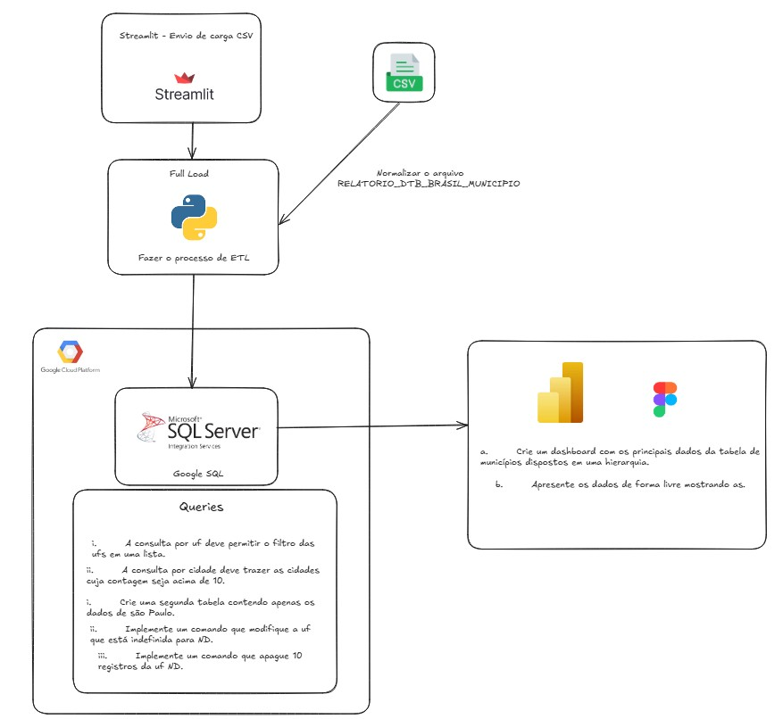

# Teste Albert Einstein  
Projeto prático de ETL com Streamlit, SQL e Python

[](https://teste-alberteinstein.streamlit.app/)
[](LICENSE)
[](https://angelogagno.github.io/Teste_Albert_Einstein/)

---
## Arquitetura do Projeto



## Como Usar

### Acesso ao Frontend

Para realizar a ingestão de novos dados via interface gráfica, acesse:  
👉 [https://teste-alberteinstein.streamlit.app/](https://teste-alberteinstein.streamlit.app/)

---

### Execução Local

Clone o repositório:

```bash
git clone https://github.com/AngeloGagno/Teste_Albert_Einstein.git
cd Teste_Albert_Einstein
```
### Configuração do Ambiente
Crie um arquivo .env na raiz do projeto, com base no modelo abaixo:

```bash
DB_HOST=HOSTNAME     # Host do banco de dados
DATABASE=master      # Nome do banco
USER=username        # Usuário de acesso
PASSWORD=password    # Senha do usuário

```
 - As informações de acesso ao banco serão fornecidas no corpo do e-mail.

## Ingestão da Tabela de Municípios
 - Adicione o arquivo da tabela na pasta tabela_municipios/

### Execute a ingestão com pip ou poetry:

#### Usando pip:

```bash
pip install -r requirements.txt
python insert_municipios.py
```
#### Usando poetry:

```bash
poetry install
poetry run python main.py
```

## Arquivos DML e Views

```bash
views/ → scripts SQL de views (.sql)

arquivos_dml/ → scripts DML (.sql)
```

## Documentação
Acesse a documentação completa do projeto:
[Documentação](https://angelogagno.github.io/Teste_Albert_Einstein/)

